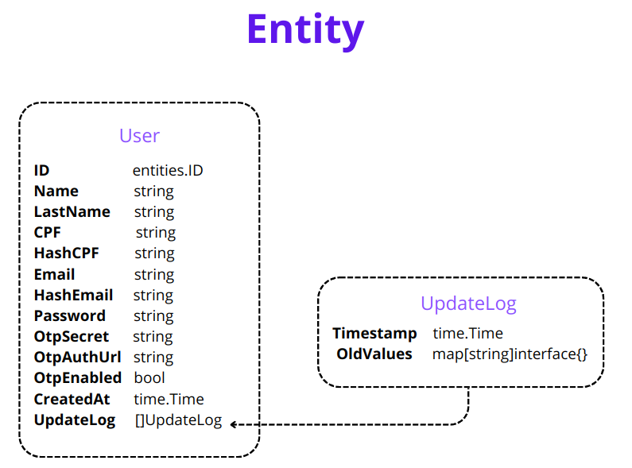

# Registro de engenharia de software

# File 

## Entidades e agregadores

    Ainda será realizada a normalização desses dados; estou aprimorando meu conhecimento em modelagem de dados para aplicá-la com maior maestria assim que chegar nessa etapa do projeto.


**Legenda**

- entities.ID = uuid

Segue a versão corrigida do texto:

### File

A entidade file possui dois campos que merecem explicação: "Versions" e "Archived".

**Versions**: Este campo pode receber **n** IDs de entidades. Esses IDs referem-se às versões recentes e anteriores do documento específico.

*Exemplo*: Um **Contrato 1** é enviado e armazenado. Na semana seguinte, esse contrato sofre uma alteração e é novamente enviado à aplicação como **Contrato 2**.

Com o objetivo de cumprir o *requisito de versionamento*, o ID do contrato atualizado (Contrato 2) será armazenado nos metadados do Contrato 1, no campo "Versions". Da mesma forma, o ID do Contrato 1 será armazenado no campo "Versions" do Contrato 2.

Entendi ser importante adicionar ao campo "Versions" também do arquivo antigo (arquivado), uma vez que a pessoa pode vir a esquecer da adição do novo contrato, ou outra pessoa pode realizar a busca sem ter conhecimento dessa atualização. Dessa forma, o arquivo antigo, mesmo que com o campo **Archived** para identificar que está arquivado, não informaria qual é o arquivo atual (vigente).

**Archived**: Este campo booleano determina se o arquivo é o atual (vigente) ou se já foi substituído por outro e agora é apenas uma versão antiga (arquivada).

Dessa forma, se o valor do campo "Archived" está como falso, significa que é o mais atual (vigente); consequentemente, se está com valor verdadeiro, significa que está arquivado para versionamento.

**Obs**: Não entendi ser necessário um campo como "UpdatedAt" para o versionamento, uma vez que a própria data de criação ("CreatedAt") do novo documento já carrega essa informação consigo.

**Update** [ 12 Jan 2024 ] - <u>Adição do campo "Authorized"</u> <br>
O objetivo deste campo é permitir que o *usuário*, aquele que está enviando o arquivo, possa autorizar outros usuários a terem acesso ao documento. <br>
Isso também evita a necessidade de duplicação de arquivos e dados.

O *usuário* não enviará os IDs autorizados, mas sim os CPFs. A aplicação será responsável por verificar se os CPFs estão registrados no sistema e coletar os respectivos IDs para atribuir à entidade *File* e persistir no banco de dados.

### Contract

**Title**: O título do contrato.

**Parties**: As partes envolvidas no contrato. Cogitei especificar algo como contratante e contratado para otimizar as buscas, contudo, dada a natureza diversa que os contratos podem adotar, entendi não ser viável e mantive apenas os nomes das partes. Isso não impede que o *client*, ao enviar o metadado, adicione o envolvimento da parte no contrato, por exemplo, "(contratante) Fulano da Silva".

**Object**: O objeto do contrato, sobre o que esse contrato trata.

**Extract** e **Invoice**: São os extratos e faturas vinculados a esse contrato. Podem ser vinculados **n** "Extracts" e "Invoices" a um contrato.

### Extract

**Account**: Número da conta.

**Category**: Categorização da transação, como depósito, saque, transferência, pagamento, etc.

**Method**: Meio de pagamento utilizado, como cartão de crédito, débito, transferência eletrônica, etc.

**Location**: Informações sobre a localização, como cidade ou país.

**Contract**: O ID do contrato ao qual esse Extrato está vinculado, caso esteja vinculado a algum contrato. Só é possível estar vinculado a um único contrato.

### Invoice

**DueDate**: A data em que o pagamento da fatura deve ser realizado.

**Method** e **Contract** são da mesma forma que para o Extrato.

## Versionamento

O versionamento traz consigo uma dinâmica no que diz respeito à relação entre os agregadores.

Sempre que uma nova versão entrar no sistema, ela deverá atualizar todas as demais automaticamente.

O campo version deve ser enviado com o(s) ID(s) do arquivo(s); isso fará com que o sistema consiga identificá-los e atualizar seu status.

O campo "CreatedAt", data de criação, é auto-suficiente para determinar qual a versão mais recente (vigente) e também qual a data de atualização, como já mencionado.

Não sendo estritamente necessário o campo "Archived", que foi implementado afim de melhorar as consultas.

**Caso um ID não registrado for recebido no campo "Versions"**: Nesse caso, a aplicação irá notificar o *client* sobre isso pela resposta, emitir o log para registro do sistema e armazenar o documento, mas removendo o ID do campo "Versions".

**Caso mais de um ID no campo "Versions" for recebido na requisição**: Se todos os IDs existirem no banco de dados, a lógica de versionamento procederá normalmente, alterando as informações nos respectivos arquivos.

- Com isso, um novo documento pode arquivar vários outros documentos.

Caso algum dos IDs não for encontrado no banco de dados, será removido do campo "Versions", e o *client* receberá a notificação informando o ocorrido.


# User 

## Entidades



JSON EXAMPLE:

```json
{
    "id": "3eae7314-b0a3-4a1a-a9eb-432f2b469c7b",
    "name": "JohnF",
    "last_name": "DoeF",
    "cpf": "222.411.314-00",
    "email": "admin@example.com",
    "created_at": "2024-02-03T00:31:27.563319Z",
    "update_log": [
        {
            "Timestamp": "0001-01-01T00:00:00Z",
            "OldValues": {
                "LastName": "Doe",
                "Name": "John"
            }
        },
        {
            "Timestamp": "0001-01-01T00:00:00Z",
            "OldValues": {
                "LastName": "DoeG",
                "Name": "JohnG"
            }
        }
    ]
}
```

**Update** [ 06 Fev 2024 ] - <u>Adição dos campos "HashCPF" e "HashEmail"</u> <br>


## Criptografia

### User


**PostgreSQL possui uma função para criptografar os dados chamada pgcrypt, que foi implementada no CockroachDB na versão 23.2.0-alpha.1. Eu tive conhecimento dessa opção apenas após a interrupção desse projeto e enquanto desenvolvia outro. Por essa razão, considero que a abordagem adotada, explicada abaixo, foi inadequada.** 


Além da password, que é armazenada como hash do bcrypt, LastName, Email e CPF também serão armazenados criptogrados. Contudo, esses ultimos serão criptografados com AES. 

Email e CPF são utilizados para login (authn), e consequentemente para busca do usuário no banco de dados. 

Estando esses dados criptografados se torna impossível a busca. Para solucionar esse problema decidi acrescentar mais dois campos ao dados de usuário, EmailHash e CPFHash. 

Dessa forma, é gerada uma hash SHA-256 para Email e CPF, que serão persistidas no banco de dados para permitir consultar os dados de usuário. 

## Rate Limit

A aplicação possui rate limit por IP e também por usuário, pelo ID.


### Rate limite por IP

O rate limit por IP é definido no nível da aplicação, usando middlewares do Go-chi, e também no nginx.

Entretanto possuem objetivos são distintos. No nginx, é aplicado de maneira abrangente, em todas as rotas da aplicação, visando principalmente evitar sobrecargas nos servidores e ataques de DDoS. Para isso, utiliza as diretivas "burst" e "nodelay", definindo um limite por segundo.

Por outro lado, na aplicação, o rate limit tem como principal objetivo a segurança na autenticação. Entretanto, também possui limites estabelecidos para o controle de sobrecarga do servidor, mas com valores específicos para cada rota, definidos por minutos.

É importante destacar que o rate limit da aplicação é individual para cada instância da aplicação (container). Foram configuradas três instâncias, e o balanceador de carga distribui a carga entre elas. Assim, os valores de rate limit foram estabelecidos levando isso em consideração.

Ex: o limite de taxa da rota authn/jwt é de 2 a cada 60 minutos. Portanto, 2 * 3 = 6 a cada 60 minutos.
